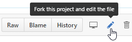
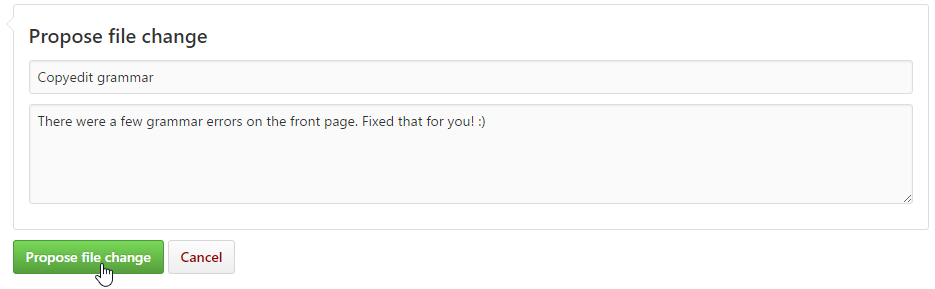

**Can I Mod** is an open-source website dedicated to documenting [Stardew Valley](http://stardewvalley.net/)
modding — everything from simple user guides (from installing SMAPI to troubleshooting mods) to
modding resources (from creating a minimal SMAPI mod to in-depth guides like parsing event data).
The site is [freely licensed](https://github.com/canimod/canimod.github.io/blob/master/LICENSE),
continuously deployed to [canimod.com](http://canimod.com/), and anyone can contribute.

## Ways to contribute
### Propose edits from your browser
You can propose changes to individual files right here on GitHub — no knowledge of Git needed.
Here's how:

1. Open the file you want to change on GitHub. The front page is [`index.md`](https://github.com/canimod/canimod.github.io/blob/master/index.md),
   and the guide pages are in [`/guides`](https://github.com/canimod/canimod.github.io/blob/master/guides).
2. Click the edit button in the top-right corner:

   

3. Make your changes. You can edit the text and [format it with Markdown](https://help.github.com/articles/getting-started-with-writing-and-formatting-on-github/),
   and click the "preview changes" tab to see what the new version will look like.
4. When you're satisfied with your edits, it's time to propose your changes. At the bottom of the
   page, enter a short title and description and click 'Propose file change':

   

5. You're done! You can watch the proposal page for updates, but one of the repository maintainers
   will take a look at your changes soon. Your changes will go live automatically within minutes
   of being accepted. Thanks!

### Create a pull request
For bigger changes, you can [fork the repository and submit a pull request](https://guides.github.com/activities/forking/).
One of the repository maintainers will take a look at your changes soon. Your changes will go live
automatically within minutes of being accepted. Thanks!

### Become a repository maintainer
While anyone can submit pull requests, nothing happens until someone approves them. This is an
open-source project, and there's always a risk when [too few people hold all the keys](https://en.wikipedia.org/wiki/Bus_factor).

That's where maintainers come in. They can commit changes directly without a pull request, and
approve pull requests from other users. Their changes are deployed to the site immediately. These
are selected from active contributors — if you haven't contributed to the project yet, start with
that! :)

Since maintainers can commit changes to the public site without approval, they must
[enable two-factor authentication](https://help.github.com/articles/about-two-factor-authentication/)
to reduce security vulnerabilities.
