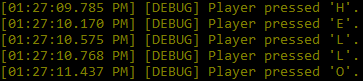

## Quick start
The rest of this page will help you create a mod. If you're experienced enough to skip the tutorial,
here's a quick summary of what this page will walk you through:

1. Create an empty C# class library project.
2. Target .NET Framework 4.5 (for Linux compatibility).
3. Reference the [`Pathoschild.Stardew.ModBuildConfig` NuGet package](https://github.com/Pathoschild/Stardew.ModBuildConfig)
   to automatically add the right references depending on the platform the mod is being compiled on.
4. Create an entry class which subclasses `StardewModdingAPI.Mod`.
5. Override the `Entry` method, and write your code using the [SMAPI events and APIs](#mod-apis).
6. Create a [`manifest.json` file](#add-your-manifest) which describes your mod for SMAPI.
6. Create [a zip file containing the mod files](#share-your-mod) for release.

## Intro

<dl>
<dt>What is SMAPI?</dt>
<dd>
   <p>A SMAPI mod uses the <a href="https://github.com/Pathoschild/SMAPI">SMAPI</a> modding API to
   extend the game logic. You can run code when something happens (e.g. mouse clicked or menu
   opened), or periodically (e.g. once per game tick).</p>
   
   <p>SMAPI mods are written in C# using the .NET Framework. Stardew Valley also uses XNA (on
   Windows) or MonoGame (on Linux and Mac) for the fundamental game logic (drawing to the screen,
   user input, etc).</p>
</dd>

<dt>Can I make a mod?</dt>
<dd>
   <ul>
      <li>
         <p><strong>Scenario A: you're new to programming.</strong><br />
         Many mod developers start with little or no programming experience. You can certainly learn
         along the way if you're determined, but you should be prepared for a steep learning curve.
         Don't be too ambitious at first; it's better to start with a small mod when you're figuring
         it out. It's easy to become overwhelmed at first and give up. The modding community is very
         welcoming, so don't be afraid to ask questions!</p>
         
         <p>Since mods are written in C#, it's a good idea to get acquainted with it first.
         <a href="https://mva.microsoft.com/en-us/training-courses/c-fundamentals-for-absolute-beginners-16169"><em>C# Fundamentals for Absolute Beginners</em></a>
         will walk you through the basics of C# needed to write SMAPI mods, from the basic concepts to
         event-driven programming (which is what SMAPI mods use).</p>
      </li>
      <li>
         <strong>Scenario B: you already have programming experience.</strong><br />
         You should be fine. Programming experience in C# or Java will make things easier, but it
         isn't critical. If you're unfamiliar with C#, you can skim through
         <a href="https://mva.microsoft.com/en-us/training-courses/c-fundamentals-for-absolute-beginners-16169"><em>C# Fundamentals for Absolute Beginners</em></a>
         to fill in any gaps.
      </li>
   </ul>
   
   The next few sections will walk you through creating a very simple mod. If you follow along,
   you'll have created a mod! All that will be left is making it do what you want. :)
</dd>

<dt>What do I need?</dt>
<dd>
   Before you start:
   <ul>
      <li>You should read the <a href="/for-players/intro"><em>intro to using mods</em></a> to
      learn the basic concepts and install SMAPI.</li>
      <li>You should install:<ul>
         <li>Stardew Valley;</li>
         <li>SMAPI;</li>
         <li>and <a href="https://www.visualstudio.com/vs/community/">Visual Studio 2017 Community</a> (on Windows)
         or <a href="http://www.monodevelop.com/">MonoDevelop</a> (on Linux/Mac).</li>
      </ul></li>
      <li>If you're not familiar with Visual Studio 2017 (on Windows) or MonoDevelop (on Linux/Mac),
      the <a href="creating-a-smapi-mod-ide-primer"><em>IDE primer</em> subguide</a> explains how
      to do the important stuff you need for this guide.</li>
   </ul>
</dd>

<dt id="help">Where can I get help?</dt>
<dd>
   The Stardew Valley modding community is very welcoming. Feel free to
   <a href="https://discord.gg/kH55QXP">come chat on Discord</a> or
   <a href="http://community.playstarbound.com/forums/mods.215/">post in the forums</a>.
</dd>
</dl>

## Create a mod
A SMAPI mod is a compiled library (DLL) with an entry method that gets called by SMAPI, so let's
set that up.

### Create the project

1. Open Visual Studio 2017 or MonoDevelop.
2. Create a solution with a C# class library project (see [how to](creating-a-smapi-mod-ide-primer#create-project)).
3. Change the target framework to .NET Framework 4.5 for compatibility with Linux (see [how to](creating-a-smapi-mod-ide-primer#set-target-framework)).
3. Delete the `Class1.cs` or `MyClass.cs` file (see [how to](creating-a-smapi-mod-ide-primer#delete-file)).

### Configure the build

1. Reference the [`Pathoschild.Stardew.ModBuildConfig` NuGet package](https://github.com/Pathoschild/Stardew.ModBuildConfig)
   (see [how to](creating-a-smapi-mod-ide-primer#add-nuget)).
   This will automatically configure your project to load the right modding dependencies for the
   current platform, so your mod can be built on Linux, Mac, or Windows. It also adds support for
   debugging the mod in-game.
2. _(optional)_ See _[simplify mod development](https://github.com/Pathoschild/Stardew.ModBuildConfig#simplify-mod-development)_
   to automatically package your mod into your mod folder and enable debugging while the game is running.

That's it! Try building the project and make sure you don't get any errors. If you get an error
like "failed to find the game install path", see [the package's _Troubleshooting_ section](https://github.com/Pathoschild/Stardew.ModBuildConfig#troubleshoot).

### Add your manifest
The mod manifest tells SMAPI about your mod.

1. Add a file named `manifest.json` to your project.
2. Paste this code into the file (replacing the `<...>` placeholders):

   ```json
   {
      "Name": "<your project name>",
      "Author": "<your name>",
      "Version": {
         "MajorVersion": 1,
         "MinorVersion": 0,
         "PatchVersion": 0,
         "Build": null
      },
      "Description": "<One or two sentences about the mod>",
      "UniqueID": "<your name>.<your project name>",
      "EntryDll": "<your project name>.dll"
   }
   ```
   This will be listed in the console output when the game is launching. (For more info about the
   version number, see [semantic versioning](http://semver.org/).)

### Write the code
Almost done! Now for the code SMAPI will run.

1. Add a C# class file called `ModEntry.cs` to your project.
2. Put this code in the file (replace `<your project name>` with the name of your project):

   ```c#
   using System;
   using Microsoft.Xna.Framework;
   using StardewModdingAPI;
   using StardewModdingAPI.Events;
   using StardewValley;

   namespace <your project name>
   {
       /// <summary>The mod entry point.</summary>
       public class ModEntry : Mod
       {
           /*********
           ** Public methods
           *********/
           /// <summary>Initialise the mod.</summary>
           /// <param name="helper">Provides methods for interacting with the mod directory, such as read/writing a config file or custom JSON files.</param>
           public override void Entry(IModHelper helper)
           {
               ControlEvents.KeyPressed += this.ReceiveKeyPress;
           }


           /*********
           ** Private methods
           *********/
           /// <summary>The method invoked when the player presses a keyboard button.</summary>
           /// <param name="sender">The event sender.</param>
           /// <param name="e">The event data.</param>
           private void ReceiveKeyPress(object sender, EventArgsKeyPressed e)
           {
               this.Monitor.Log($"Player pressed {e.KeyPressed}.");
           }
       }
   }
   ```

### Try your mod

1. Build the project.
2. Copy your mod into your game's `Mods` folder (only if you didn't do step 2 of _[configure the build](#configure-the-build)_).
   1. In the game's `Mods` directory, add a folder with your mod's name.
   2. Copy your `manifest.json` and compiled files (see [how to find them](creating-a-smapi-mod-ide-primer#build-output))
      into the folder you created.
3. Run the game through SMAPI.

The mod so far will just send a message to the console window whenever you press a key in the game:

> 

If that didn't work, something went wrong. Try reviewing the above instructions, or
[ask for help](#help). :)

## Mod APIs
Now that you have a basic mod, here are the SMAPI features you can use to do more.

### Events
<span id="available-events"></span>

SMAPI publishes several C# events that tell you when something happens. For example, if you want
to do something after the player loads their save, you can add this to your `Entry` method:

```c#
SaveEvents.AfterLoad += this.ReceiveAfterLoad;
```

Then declare a method like this. (The `EventArgs e` argument will often provide more details about
what happened, if there are any.)

```c#
/// <summmary>The event handler called after the player loads their save.</summary>
/// <param name="sender">The event sender.</param>
/// <param name="e">The event arguments.</param>
public void ReceiveAfterLoad(object sender, EventArgs e)
{
   this.Monitor.Log("The player loaded their game! This is a good time to do things.");
   this.Monitor.Log("Everything in the world is ready to interact with at this point.");
}
```

Here are the available events:

* <span id="content-events"></span>
  **`ContentEvents`** are raised when the game loads content from its XNB files or changes locale.

  | event | summary |
  |:----- |:------- |
  | AssetLoading | **[SMAPI 2.0+ only]** Raised when an XNB file is being read into the cache. Mods can change the data here before it's cached.
  | AfterLocaleChanged | Raised after the content language changes.

* <span id="control-events"></span>
  **`ControlEvents`** are raised when the player uses a controller, keyboard, or mouse. They're
  raised before the game handles the input, so it's possible to selectively prevent the game from
  responding to it. (That's beyond the scope of this guide, but it involves overwriting
  `Game1.oldKBState`, `Game1.oldMouseState`, and `Game1.oldPadState`.)

  Most of these events are split into two variants, `XPressed` and `XReleased`. The `Pressed`
  variant is raised when the player presses the button (holding the button down only triggers the
  event once), and the `Released` variant is raised when they release it.

  | event | summary |
  |:----- |:------- |
  | ControllerButtonPressed<br />ControllerButtonReleased | Raised after the player pressed/released a button on a gamepad or controller. These events aren't raised for trigger buttons. |
  | ControllerTriggerPressed<br />ControllerTriggerReleased | Raised after the player pressed/released a trigger button on a gamepad or controller. |
  | KeyPressed<br />KeyReleased | Raised after the player pressed/released a keyboard key. |
  | KeyboardChanged | Raised after the game's `KeyboardState` changed. That happens when the player presses or releases a key. |
  | MouseChanged | Raised after the game's `MouseState` changed. That happens when the player moves the mouse, scrolls the mouse wheel, or presses/releases a button. |

* <span id="game-events"></span>
  **`GameEvents`** are raised when the game changes state.

  | event | summary |
  |:----- |:------- |
  | Initialize | Raised during launch after configuring XNA or MonoGame. The game window hasn't been opened by this point. Called from [XNA's `Game.Initialize` method](https://msdn.microsoft.com/en-us/library/microsoft.xna.framework.game.initialize.aspx). |
  | LoadContent | Raised before XNA loads or reloads graphics resources. Called from [XNA's `Game.LoadContent` method](https://msdn.microsoft.com/en-us/library/microsoft.xna.framework.game.loadcontent.aspx).
  | GameLoaded | Raised when the game is ready and initialised. At this point the game data (like `Game1.objectInformation`) is in memory and ready for use. |
  | UpdateTick | Raised when the game updates its state (≈60 times per second). |
  | SecondUpdateTick | Raised every other tick (≈30 times per second). |
  | FourthUpdateTick | Raised every fourth tick (≈15 times per second). |
  | EighthUpdateTick | Raised every eighth tick (≈8 times per second). |
  | QuarterSecondTick | Raised every 15th tick (≈4 times per second). |
  | HalfSecondTick | Raised every 30th tick (≈twice per second). |
  | OneSecondTick | Raised every 60th tick (≈once per second). |

* <span id="graphics-events"></span>
  **`GraphicsEvents`** are raised during the game's draw loop, when the game is rendering content
  to the window.

  | event | summary |
  |:----- |:------- |
  | OnPreRenderEvent<br />OnPostRenderEvent | Raised before and after drawing the world to the screen.
  | OnPreRenderGuiEvent<br />OnPostRenderGuiEvent | When a menu is open (`Game1.activeClickableMenu != null`), raised before and after drawing that menu to the screen. This includes the game's internal menus like the title screen. |
  | OnPreRenderHudEvent<br />OnPostRenderHudEvent | Raised before and after drawing the HUD (item toolbar, clock, etc) to the screen. The HUD is available at this point, but not necessarily visible. (For example, the event is called even if a menu is open.) |
  | Resize | Raised after the game window is resized. |

* <span id="location-events"></span>
  **`LocationEvents`** are raised when the player transitions between game locations, a location is
  added or removed, or the objects in the current location change.

  | event | summary |
  |:----- |:------- |
  | CurrentLocationChanged | Raised after the player warps to a new location. Handlers are given the previous and new locations as arguments. |
  | LocationObjectsChanged | Raised after the list of objects in the current location changes (e.g. an object is added or removed). Handlers are given the new list of objects as an argument. |
  | LocationsChanged | Raised after a game location is added or removed. Handlers are passed the new list of locations as an argument. |

* <span id="control-events"></span>
  **`MenuEvents`** are raised when a game menu is opened or closed (including internal menus like
  the title screen).

  | event | summary |
  |:----- |:------- |
  | MenuChanged | Raised after a game menu is opened or replaced with another menu. This event is not invoked when a menu is closed. Handlers are given the previous menu (if any) and new menu (if any). |
  | MenuClosed | Raised after a game menu is closed. Handlers are given the previous menu. |

* <span id="mine-events"></span>
  **`MineEvents`** are raised when something happens in [The Mines](http://stardewvalleywiki.com/The_Mines).

  | event | summary |
  |:----- |:------- |
  | MineLevelChanged | Raised after the player warps to a new level of the mine. Handlers are passed the previous and new mine level as arguments. |

* <span id="player-events"></span>
  **`PlayerEvents`** are raised when the player data changes.

  | event | summary |
  |:----- |:------- |
  | InventoryChanged | Raised after the player's inventory changes in any way (added or removed item, sorted, etc). |
  | LeveledUp | Raised after the player levels up a skill. This happens as soon as they level up, not when the game notifies the player after their character goes to bed. |

  Notable bug: the `InventoryChanged` and `LeveledUp` events are raised at various times before
  the game is loaded, when there's no character yet.

* <span id="save-events"></span>
  **`SaveEvents`** are raised when the player saves or loads the game.

  | event | summary |
  | ----- | ------- |
  | AfterLoad | Raised after the player loads a saved game. The world is ready for mods to modify at this point.
  | BeforeSave | Raised before the game updates the save file. (The save won't be written until all mods have finished handling this event.)
  | AfterSave | Raised after the game finishes updating the save file.
  | AfterReturnToTitle | Raised after the player exits to the title screen.

* <span id="time-events"></span>
  **`TimeEvents`** are raised when the in-game date or time changes.

  | event | summary |
  |:----- |:------- |
  | AfterDayStarted | Raised after the game begins a new day, including when loading a save. |
  | TimeOfDayChanged | Raised after the in-game clock changes. |
  | DayOfMonthChanged | Raised after the day-of-month value changes (including when the player loads a save). This may happen before an end-of-day save; in most cases you should use `AfterDayStarted` instead. |
  | SeasonOfYearChanged | Raised after the season changes. |
  | YearOfGameChanged | Raised after the year changes. |

### Configuration
You can let users configure your mod through a `config.json` file. SMAPI will automatically create
the file and take care of reading, normalising, and updating it.

Here's the simplest way to use `config.json`:

1. Create your model. This is just a class with properties for the config options you want, and it
   can contain almost anything from a few boolean fields to a complex object graph. (You should try
   to keep it simple for your users, though.)

   You can set defaults directly:

   ```c#
   class ModConfig
   {
      public bool ExampleBoolean { get; set; } = true;
      public float ExampleFloat { get; set; } = 0.5;
   }
   ```

   ...or with a constructor:

   ```c#
   class ModConfig
   {
      public bool ExampleBoolean { get; set; }
      public float ExampleFloat { get; set; }

      public ModConfig()
      {
         this.ExampleBoolean = true;
         this.ExampleFloat = 0.5;
      }
   }
   ```

2. In your `ModEntry::Entry` method, add this line to read the config options:

   ```c#
   ModConfig config = helper.ReadConfig<ModConfig>();
   ```

That's it! When the player launches the game, SMAPI will create the `config.json` file
automatically if it doesn't exist yet, using the default config options you provided in your model.

If you need to edit and save the config, you can use `helper.SaveConfig(config)`. You can access
the helper in other methods using `this.Helper`.

For more advanced config and JSON scenarios, see _[advanced configuration](creating-a-smapi-mod-advanced-config)_
which covers...

* adding custom JSON files;
* adding per-save JSON files;
* using a config wrapper for file I/O;
* overriding JSON serialization.

### Logging
Your mod can write messages to the console window and log file using the monitor. For example,
this code:

```c#
this.Monitor.Log("a trace message", LogLevel.Trace);
this.Monitor.Log("a debug message", LogLevel.Debug);
this.Monitor.Log("an info message", LogLevel.Info);
this.Monitor.Log("a warning message", LogLevel.Warn);
this.Monitor.Log("an error message", LogLevel.Error);
```

will log something like this:

<pre>
<span style="color:#666;">[18:00:00 TRACE Mod Name] a trace message</span>
<span style="color:#666;">[18:00:00 DEBUG Mod Name] a debug message</span>
<span style="color:black;">[18:00:00 INFO  Mod Name] an info message</span>
<span style="color:darkorange;">[18:00:00 WARN  Mod Name] a warning message</span>
<span style="color:red;">[18:00:00 ERROR Mod Name] an error message</span>
</pre>

Note that `LogLevel.Trace` messages won't appear in the console window by default, they'll only
be written to the log file. Trace messages are for troubleshooting details that are useful when
someone sends you their error log, but which the player normally doesn't need to see. (You can see
trace messages in the console if you install the "SMAPI for developers" version.)

### Reflection
SMAPI provides an API for robustly accessing the game's private fields or methods. You can use it
from `helper.Reflection` in your entry method, or `this.Helper.Reflection` elsewhere in your
entry class. It consists of three methods:

* `GetPrivateValue<TValue>(...)` returns the value of a private field.
* `GetPrivateField<TValue>(...)` returns an object you can use to get or set a field's value.
* `GetPrivateMethod(...)` returns an object you can use to invoke a method.

Here are a few examples of what this lets you do:

```c#
// did you pet your pet today?
bool wasPet = this.Helper.Reflection.GetPrivateValue<bool>(pet, "wasPetToday");

// what is the spirit forecast today?
string forecast = this.Helper.Reflection
   .GetPrivateMethod(new TV(), "getFortuneForecast")
   .Invoke<string>();

// randomise the mines
if(Game1.currentLocation is MineShaft)
   this.Helper.Reflection.GetPrivateField<Random>(Game1.currentLocation, "mineRandom").SetValue(new Random());
```

This works with static or instance fields/methods, caches the reflection to improve performance, and will
throw useful errors automatically when reflection fails.

If you need to do more, you can also switch to C#'s underlying reflection API:

```c#
FieldInfo field = this.Helper.Reflection.GetPrivateField<string>(…).FieldInfo;
MethodInfo method = this.Helper.Reflection.GetPrivateMethod(…).MethodInfo;
```

### Mod registry
Your mod can get information about loaded mods, or check if a particular mod is loaded. (All mods
are loaded by the time your mod's `Entry(…)` method is called.)

```c#
// check if a mod is loaded
bool isLoaded = this.Helper.ModRegistry.IsLoaded("UniqueModID");

// get manifest info for a mod (name, description, version, etc.)
IManifest manifest = this.Helper.ModRegistry.Get("UniqueModID");

// get manifest info for all loaded mods
foreach(IManifest manifest in this.Helper.ModRegistry.GetAll()) { … }
```

## Final considerations

### Crossplatform support
SMAPI will automatically adjust your mod so it works on Linux, Mac, and Windows. However, there are
a few things you should do to avoid problems:

1. Use the [crossplatform build config](https://github.com/Pathoschild/Stardew.ModBuildConfig#readme)
   package to automatically set up your project references. This makes crossplatform compatibility
   easier and lets your code compile on any platform. (If you followed the above guide, you already
   have this.)

2. Use `Path.Combine` to build file paths, don't hardcode path separators since they won't work on
   all platforms.

   ```cs
   // ✘ Don't do this! It will crash on Linux/Mac.
   string path = helper.DirectoryPath + "\assets\asset.xnb";

   // ✓ This is OK
   string path = Path.Combine(helper.DirectoryPath, "assets", "asset.xnb");
   ```

3. Use `helper.DirectoryPath`, don't try to determine the mod path yourself.

   ```cs
   // ✘ Don't do this! It will crash if SMAPI rewrites the assembly (e.g. to update or crossplatform it).
   string modFolder = Assembly.GetCallingAssembly().Location;

   // ✓ This is OK
   string modFolder = helper.DirectoryPath;
   ```

### Test on all platforms
If you want to test your mod on all platforms, there's some first-time setup you need to get out of
the way. Essentially you need to test your mod twice: once on Windows, and again on Linux or Mac.
You can do that by testing one version on your computer, and the other in a virtual machine.

#### If your main computer is Windows

1. Install [VirtualBox](https://www.virtualbox.org/).
2. Add [this premade Linux virtual machine](https://www.dropbox.com/s/nrq9xsde2afp4ey/StardewValleyLinuxModding.7z)
   (requires a 64-bit computer).  
   _<small>In VirtualBox, click Machine » Add and choose the downloaded `.vbox` file. This is a
   [Manjaro](https://manjaro.org/) virtual machine with Chromium (web browser), Steam, and
   [MonoDevelop](http://www.monodevelop.com/) preinstalled.</small>_
4. Launch the virtual machine, and install Stardew Valley from the Steam client (preinstalled) or GOG website.  
   _<small>Tip: don't change the default install path, or you'll need to customise the mod's build
   configuration.</small>_

#### If your main computer is Linux or Mac

1. Install [VirtualBox](https://www.virtualbox.org/).
2. [Create a VM with Windows](http://www.macworld.co.uk/how-to/mac-software/run-windows-10-on-your-mac-using-virtualbox-3621650/).
3. Install [Visual Studio Community](https://www.visualstudio.com/vs/community/) in your VM.
4. Install Stardew Valley in your VM.

### Release your mod
Ready to share your mod with the world? Let's say you created a mod named _Pineapples Everywhere_
which turns all NPCs into pineapples; here's how you would release it for others to use.

1. Copy your compiled mod and `manifest.json` into a folder matching your mod's name.
2. Create a zip archive with your mod's name, version, and platform.

   Your mod structure should look something like this:

   ```
   PineapplesEverywhere-1.0-Windows.zip
      PineapplesEverywhere/
         PineapplesEverywhere.dll
         PineapplesEverywhere.pdb
         config.json
         manifest.json
   ```

3. Upload your mod to [Nexus Mods](http://www.nexusmods.com/stardewvalley), the
   [official modding forums](http://community.playstarbound.com/forums/mods.215/), or both.

## Decompile the game code
When you start working on more complex mods, you may need to look at how the game code works.

Here's how to decompile the game code so you can look at it:

1. Open `StardewValley.exe` in [dotPeek](https://www.jetbrains.com/decompiler/).
2. Right-click on _Stardew Valley_ and choose _Export to Project_. Accept the default options to
   create a decompiled project you can open in Visual Studio. (Note that the decompiled code will
   not be functional due to limitations of the decompiler, but you'll be able to read the game code.)

Here's how to unpack the XNB data files:

1. Download the [Easy XNB Pack/UnPack Toolkit](http://community.playstarbound.com/threads/modding-guides-and-general-modding-discussion-redux.109131/page-6#post-2837587).
2. Copy the entire `Stardew Valley\Content` game folder into `XNB-Mod-Toolkit\Packed`.
3. Run `XNB-Mod-Toolkit\UNPACK FILES.bat` to unpack the files into `XNB-Mod-Toolkit\Unpacked`.
