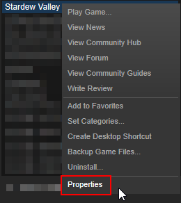
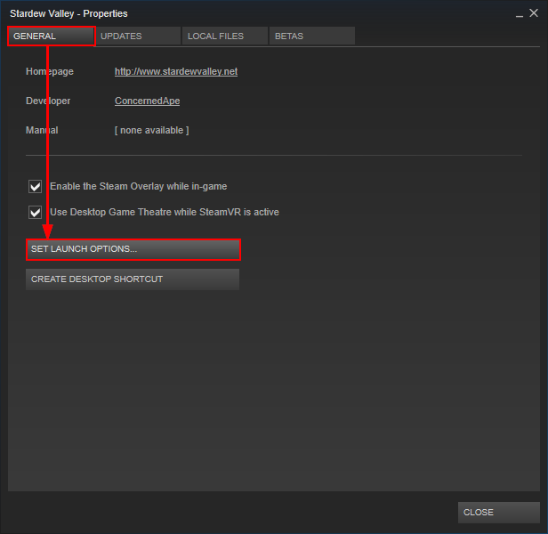

<div class="scroll-box" style="float: right;">
    <strong>For players</strong>
    <ul>
        <li><a href="/for-players/intro">Intro</a></li>
        <li><strong>Install SMAPI</strong></li>
        <li><a href="/for-players/use-mods">Use mods</a></li>
        <li><a href="/for-players/faqs">Troubleshooting & FAQs</a></li>
    </ul>
</div>

SMAPI is the tool which launches the game with mods (which are [downloaded separately](#using-mods)).
It's safely installed alongside your normal game, and you can uninstall it anytime.

## Install SMAPI
### On Windows
#### Part 1: install SMAPI
1. Run the game without SMAPI at least once so it can do first-time setup if needed.
2. Download the [latest version of SMAPI](https://github.com/Pathoschild/SMAPI/releases).
3. Extract the `.zip` file somewhere (but not in your game folder!).
4. Double-click `install.exe`, and follow the on-screen instructions.  
   _The installer will detect your game and add SMAPI for you._

**If you have Steam, continue to the next section.** Otherwise just run `StardewModdingAPI.exe`
in [your game folder](http://canimod.com/for-players/faqs#game-folder) to play with mods.

#### Part 2: configure Steam
If you use Steam, you can launch SMAPI from the Steam client to enable the Steam overlay and
achievements. This requires a few more steps.

1. In the Steam client, right-click on _Stardew Valley_ and choose _Properties_:

   > 

2. Click _General > Set Launch Options_:

   > 

3. In the textbox, enter this text exactly as shown:

   ```"\StardewModdingAPI.exe" %command%```

4. Open [your game folder](http://canimod.com/for-players/faqs#game-folder), select the full
   address, and press `CTRL` + `C` to copy it. (Your path is probably different; that's fine.)

   > 

5. In the textbox right before `\`, press `CTRL` + `V` to paste the address. The textbox should now
   look something like this:

   > 

6. Click OK to save your changes.
7. From now on, just launch the game through Steam to run SMAPI with the Steam overlay and
   achievements.

### On Linux
1. Download the [latest version of SMAPI](https://github.com/Pathoschild/SMAPI/releases).
2. Extract the `.zip` file somewhere (but not in your game folder!).
3. Open a terminal in the extracted folder and run `mono install.exe`.  
   _The installer will detect your game and add SMAPI for you. (If you get an error like
   'mono: command not found', you need to install [Mono](http://www.mono-project.com/).)_

That's it! Just launch the game to play with mods. To remove SMAPI later, run `mono install.exe`
again and choose _uninstall_.

### On Mac
1. Download the [latest version of SMAPI](https://github.com/Pathoschild/SMAPI/releases).
2. Extract the `.zip` file somewhere (but not in your game folder!).
3. Open a terminal in the extracted folder and run `mono install.exe`.  
   _Here's how: (1) open the Terminal app; (2) type `mono` then a space; (3) drag & drop the
   `install.exe` file onto the Terminal window to paste its file path; (4) press enter on your
   keyboard._  
   _(If you get an error like 'mono: command not found', you need to install
   [Mono](http://www.mono-project.com/) first.)_

That's it! Just launch the game to play with mods. To remove SMAPI later, run `mono install.exe`
again and choose _uninstall_.

### Manual install
The installer is the recommended way to install SMAPI, but you can also install it manually.

1. Download the [latest version of SMAPI](https://github.com/Pathoschild/SMAPI/releases).
2. Unzip the `.zip` file somewhere.
3. Copy the files from the `internal/Mono` folder (if Linux/Mac) or `internal/Windows` folder (if
   Windows) into [your game folder](http://canimod.com/for-players/faqs#game-folder). If you did it
   properly, the `StardewModdingAPI.exe` file should be right next to the game's executable.
4. Make sure the game launches with SMAPI.
   * **Scenario A: you play on Windows:**  
     See [part 2 in the Windows instructions](#on-windows).
   * **Scenario B: you play on Linux or Mac:**  
     1. Open the game folder.
     2. Rename the `StardewValley` file (with no extension) to `StardewValley-original`.
     3. Rename the `StardewModdingAPI` file (with no extension) to `StardewValley`.

## Update SMAPI
To update SMAPI, just install the new version. The installer will automatically clean up previous
versions. (If you use Steam, you don't need to set the launch options again.)

## Uninstall SMAPI
To remove SMAPI, just run `install.exe` again and choose _uninstall_. If you need to uninstall
manually, just do the opposite of _[manual install](#manual-install)_.

<div class="scroll-box" style="display: inline-block;">
<big><strong>next:</strong> <a href="/for-players/use-mods">Use mods →</a></big>
</div>
