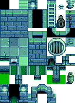

## Getting started

### Basic concepts
* A **map** is the layout of the terrain (like water, cliffs, and land), terrain features (like
  bushes), buildings, paths, and triggers for a particular area. When you reach the edge of an area
  or enter a building, and the screen fades to black during the transition, you're moving between
  maps.

* Each map consists of several **layers** stacked one in front of the other. Objects in a layer
  closer to the front will hide objects in layers behind them. From back to front, the standard
  layers are...

  layer name  | typical contents
  :---------- | :---------------
  Back        | Terrain, water, and basic features (like permanent paths).
  Buildings   | Placeholders for buildings (like the farmhouse).
  Paths       | Flooring, paths, grass, and debris (like stones, weeds, and stumps) which can be removed by the player.
  Front       | Objects that are drawn on top of things behind them, like most trees.
  AlwaysFront | Objects that are always drawn on top of other layers. This is typically used for foreground effects like foliage cover.

* Each layer consists of many **tiles**, which are 16×16 pixel squares placed in a grid to form the
  visible map. Each tile can have properties (e.g. passable / blocked), special logic (e.g. an
  action to perform when the player steps on them), and a picture to show. The picture is
  represented by a sprite index (or tile index), which is its position in an associated spritesheet
  (see next).

* Each map has one or more **spritesheets** (also called **tilesheets** in the context of maps),
  which is a file containing many images in a grid pattern:

  

  Each square in the tilesheet's grid pattern is called a **sprite**, and is typically 16×16 pixels
  for a map spritesheet. For example, here's a single sprite from the above spritesheet:

  

  Note that sprites might be drawn next to each other to create the illusion of a larger object:

  

### First time-setup
<p class="warning">
This guide only covers Windows. If you know how to do this on Linux/Mac, let us know!
</p>

Before you start, you'll need these prerequisites:

* **[XNB Extract by Drogean](http://community.playstarbound.com/threads/modding-guides-and-general-modding-discussion-redux.109131/)**
  is a toolkit for unpacking and packing the game's XNB files, which are compressed files
  containing maps, images, or other data. This is a portable app — no install needed.
* **[tIDE 2.0.8](https://cdn.discordapp.com/attachments/156109690059751424/249890421805678592/tIDESetup208.msi)**
  is a map editor for the game's map format. This version was customised by Kithi to enable
  conversion between the game's `.tbin` files and the `.tmx` files we'll be editing. It fixes an
  issue where exporting to `.tmx` would lose tile data like animations.
* **[Tiled](http://www.mapeditor.org/)** is the map editor we'll use to edit the game's maps. It
  has some advantages over tIDE like automatic edge-fixing, better performance, and fewer bugs
  when editing Stardew Valley maps.

## Editing a map
Here's how to edit a Stardew Valley map:

1. **Unpack the file for editing:**
   1. Find the map file you want to edit in the `Contents\Maps` folder.
   2. Copy it into XNB Extract's `Packed` folder, and run `UNPACK FILES.bat`.
   3. Open the unpacked `.tbin` file in tIDE.
   4. Resave the file as "Tiled XML Map Files (*.tmx)".
   5. When asked how to store the layer data, choose "CSV".
2. **Make your changes:**
   1. Open the `.tmx` file in Tiled.
   2. Make the desired changes (see _[editing tips](#editing-tips)_ below).
   3. Save the file.
3. **Repack the file for the game:**
   1. Open the `.tmx` file in tIDE.
   2. Resave the file as "tIDE Binary Map Files (*.tbin)".
   3. Move the `.tbin` file into XNB Extract's `Unpacked` folder, and run `PACK FILES.bat`.
   4. Move the repacked `.xnb` file back to the original location.

## Editing tips

### Read the manual
The [Tiled documentation](http://doc.mapeditor.org/) might help with questions about using it.

### Tile coordinates
Each tile has an (x, y) coordinate which represents its position on the map, where (0, 0) is the
top-left tile. The _x_ value increases towards the right, and _y_ increases downwards. For example:


### Using custom sprites
You can add custom sprites (images) to a map:

1. Create your spritesheet. This should be a PNG image with images divided into 16x16 tiles (see _[basic concepts](#basic-concepts)_
   for examples).
2. Open the map in Tiled.
3. Add the custom spritesheet:
   1. In the _Tilesets_ pane, click the  _new tilesheet_ button.
   2. Give it a descriptive name (like 'cute bugs') and choose the image source.
   3. Keep the default settings and click _OK_.
4. Add custom sprites to the map:
   1. In the _Layers_ pane, click the layer you want to edit.
   1. In the _Tilesets_ pane, click the tab for your custom spritesheet.
   2. In the _Tilesets_ pane, click one tile to select it. To choose multiple, click and drag the
      cursor.
   3. Move the cursor to the map, and you'll see an overlay with the tiles you selected.
   5. Click the map to place those tiles on the selected layer.
   6. Right-click to stop placing tiles.

### Map properties
Each map can have multiple map properties, which define attributes and behaviour associated with
the map like lighting, music, warp points, etc. Each property has a name (which defines the type of
property) and value (which configures the property).

To view and edit map properties in Tiled, click _Map_ on the toolbar and choose _Map Properties_.

Known map properties<sup>1</sup>:

property | explanation
-------- | -----------
`AmbientLight {int r} {int g} {int b}` | Sets the [RGB colour](https://en.wikipedia.org/wiki/RGB_color_model) of the ambient light.<br />_Example: `AmbientLight 95 95 95` for a normal indoor daytime lighting._
`BrookSounds [{int x} {int y} {int sound}]` | Adds sound sources. The `x y` fields are the tile coordinates, and `sound` is the ambient sound ID.
`DayTiles [{string layer} {int x} {int y} {int type}]+` | Sets which tiles should glow during the day to simulate sunlight streaming through windows. The `layer` field is the map layer name, `x y` are the tile coordinates, and `type` specifies the glow type (e.g. 256 and 288 for an upper and lower window).<br />_Example: `DayTiles Front 3 1 256 Front 3 2 288`._
`Doors {int x} {int y} {string sheetID} {int tileID}` | Adds a door. The `x y` fields are the tile coordinates, `sheetID` is the name of the sheet containing the door sprite, and `tileID` is the tile index in the spritesheet.
`Fall_Objects`<br />`Spring_Objects`<br />`Summer_Objects`<br />`Winter_Objects` | Whether to spawn seasonal objects on spawnable tiles based on the data in `Data\Locations.xnb`. Property values are ignored.<br />_Example: `Fall_Objects`._
`Light [{int x} {int y} {int type}]+` | Adds light sources. The `type` field is the kind of light source (e.g. 4 for twin candles), and `x y` are the tile coordinates.<br />_Example: `Light 3 8 4 6 8 4 11 8 4 3 2 5 10 2 5 6 19 5 5 15 5 5 11 5 11 12 5` (Adventurer's Guild)._
`Music {str name}` | Sets the music that plays when the player enters, where `name` is the cue name in the audio files.<br />_Example: `Music MarlonsTheme`._
`NightTiles [{string layer} {int x} {int y} {int type}]+` | Like `DayTiles` for moonlight at night.
`Outdoors T`<sup>2</sup> | Sets whether the location is outdoors.<br />_Example: Outdoors true_.
`TreatAsOutdoors T`<sup>2</sup> | ?
`Trees [{int x} {int y} {int type}]+` | Adds trees to the map. The `x y` fields are the tile coordinates, and `type` is the tree type (1: oak, 2: maple, 3: pine, 6: palm, 7: mushroom tree).<br />_Example: `Trees 17 18 2 20 31 2`_.
`UniquePortrait [{str name}]+` | ?
`UniqueSprite [{str name}]+` | ?
`ViewportFollowPlayer T`<sup>2</sup> | Forces the viewport to stay centered on the player.<br />Example: `ViewportFollowPlayer`.
`Warp [{int fromX} {int fromY} {string toArea} {int toX} {int toY}]+` | Sets the tiles which warp the player to another map (e.g. doors). The `fromX fromY` fields are the tile coordinates that initiate the warp, and `toArea toX toY` are the name of the in-game location to warp to and the tile coordinates within it.<br />_Example: 6 20 Mountain 76 9_.

The following properties are used but apparently have no effect:

property | explanation
-------- | -----------
`Arch` | ignored?
`Debris` | ignored?
`Fish` | ignored?


<small><sup>1</sup> Map properties are handled in `GameLocation::resetForPlayerEntry` and `GameLocation::loadObjects`.</small>  
<small><sup>2</sup> The `T` value (short for _true_) is conventional, but any non-empty value will work too.</small>

### Tile properties
You can set tile properties to perform actions when the player steps on the tile or interacts with
it. Each property has a name (which defines the type of property)
and value (which configures the property).

To view and edit map properties in Tiled:

1. _No idea. (todo)_

Known tile properties (excluding specialised properties like `TouchAction WomensLocker`):<sup>1</sup>

layer | property | explanation
----- | -------- | -----------
`Back` | `Diggable T`<sup>2</sup> | Marks the tile as diggable with the hoe and enables planting crops.
`Back` | `NoFurniture T`<sup>2</sup> | Prevents the player from placing furniture on this tile.
`Back` | `NoSpawn All`<br />`NoSpawn True` | Combines `NoSpawn Grass` and `NoSpawn Tree`.
`Back` | `NoSpawn Grass` | Prevents debris (e.g. weeds or stones) from spawning on this tile.
`Back` | `NoSpawn Tree` | Prevents trees from spawning on this tile. Prevents the player from planting trees on this tile, except on the farm. If a tree is already on this tile, prevents it from growing.
`Back` | `NPCBarrier T`<sup>2</sup> | Prevents NPCs from crossing this tile.
`Back` | `Type {str type}` | Sets the tile type for various game logic (e.g. step sounds or planting crops), where `type` is one of `Dirt`, `Stone`, `Grass`, `Wood`.
`Back` | `Water T`<sup>2</sup> | Marks the tile as a water tile for various game logic (e.g. items splash into it, can refill watering can from it, can't walk on it, etc).
`Back` | `WaterSource T`<sup>2</sup> | Lets the player refill the watering can from this tile.

The `TouchAction` property makes something happen when the player steps on the tile:

layer | property | explanation
----- | -------- | -----------
`Back` | `TouchAction ChangeIntoSwimsuit` | Changes the player into their swimsuit and disables running.
`Back` | `TouchAction ChangeOutOfSwimsuit` | Changes the player into their regular clothes and enables running.
`Back` | `TouchAction Door {str npc}` | If the player doesn't have 2+ friendship hearts with the villager named by the `npc` field: stops the player, marks the tile as impassible, and displays a door-locked message.
`Back` | `TouchAction Emote {str npc} {int emoteID}` | Finds the NPC whose name matches the `npc` field, and causes them to show the given `emoteID` above their head (4: empty can, 8: question mark, 12: angry, 16: exclamation, 20: heart, 24: sleep, 28: sad, 32: happy, 36: x, 40: pause, 52: videogame, 56: music note, 60: blush).
`Back` | `TouchAction FacingDirection {str npc} {int direction}` | Finds the NPC whose name matches the `npc` field, and make them face the given direction (0: up, 1: right, 2: down, 3: left).
`Back` | `TouchAction MagicWarp {str area} {int x} {int y} [{str prerequisite}]` | Warps the player to the `x y` tile coordinates in the given `area` with a magic sound and effects. If the `prerequisite` field is specified, only occurs if that flag is set via `Game1.player.mailReceived`.
`Back` | `TouchAction PoolEntrance` | Switches the player between swimming and walking mode.
`Back` | `TouchAction Sleep` | Ends the day if the player confirms.

The `TouchAction` property makes something happen when the player interacts (e.g. clicks) with the tile:

layer | property | explanation
----- | -------- | -----------
`Buildings` | `Action AdventureShop` | Shows the Adventurer's Guild shop screen.
`Buildings` | `Action Arcade_Prairie` | Shows the _Journey of the Prairie King_ arcade game.
`Buildings` | `Action Arcade_Minecart` | Shows the _Junimo Kart_ arcade game.
`Buildings` | `Action BuyBackpack` | Shows a menu which lets the player upgrade their backpack if an upgrade is available.
`Buildings` | `Action Billboard` | Shows the calendar menu.
`Buildings` | `Action ColaMachine` | Offers to let the player buy a Joja cola.
`Buildings` | `Action ClubShop` | Shows the casino shop menu.
`Buildings` | `Action ClubSlots` | Shows the casino slots minigame.
`Buildings` | `Action JojaShop` | Shows the Joja shopping screen.
`Buildings` | `Action Jukebox` | Shows the jukebox menu to choose the ambient music.
`Buildings` | `Action kitchen` | Shows the cooking menu.
`Buildings` | `Action Letter {str text}` | Shows the letter menu on-screen with the given text, with the syntax used by `Data\mail.xnb`.<br />_Example: `Action Letter Hey there!^I had some extra wood lying around... I thought maybe you could use it. Take care!  ^   -Robin %item object 388 50 %%`_.
`Buildings` | `Action Mailbox` | Shows the next letter from the player's mailbox (if any).
`Buildings` | `Action Material` | Shows a summary of the player's stockpiled wood and stone.
`Buildings` | `Action MinecartTransport` | Shows the minecart destination menu (or a message if not unlocked).
`Buildings` | `Action Notes {int noteID}` | If the player has found the specified lost book, displays its museum note text and marks it read.<br />_Example: Action Notes 17_.
`Buildings` | `Action Warp {int x} {int y} {str area}` | Warps the player to the `x y` tile coordinate in the `area` game location.<br />_Example: Action Warp Mountain 76 9_.
`Buildings` | `Action WizardShrine` | Shows the character customisation menu normally available from the Wizard's tower.

<small><sup>1</sup> Tile properties are handled throughout the codebase using `GameLocation::doesTileHaveProperty`. Actions and touch actions are handled by `GameLocation::performAction` and `GameLocation::performTouchAction` respectively. Emote IDs are listed as `Character` constants.</small>  
<small><sup>2</sup> The `T` value (short for _true_) is conventional, but any non-empty value will work too.</small>

## Editing maps from a SMAPI mod
The previous sections describe how to edit a map by editing its file, but you can also edit it
programmatically at runtime in a [SMAPI mod](/guides/creating-a-smapi-mod):

```c#
GameLocation location = Game1.currentLocation;

/*********
** Manage map properties
*********/
// get
string value = location.map.Properties.ContainsKey("Music")
    ? location.map.Properties["Music"].ToString()
    : null;

// set
location.map.Properties["Music"] = "MarlonsTheme";

/*********
** Manage tile properties
*********/
// get
string value = location.doesTileHaveProperty(tileX, tileY, "Diggable", "Back");

// set
location.setTileProperty(tileX, tileY, "Back", "Diggable", "T");

/*********
** Edit tiles
*********/
// remove tile
location.removeTile(tileX, tileY, "Back");
location.waterTiles[tileX, tilyY] = false;

// add tile
var layer = location.map.GetLayer("Back");
layer.Tiles[tileX, tileY] = new StaticTile(layer, "tilesheet name", BlendMode.Alpha, tileID);
```
