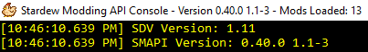

## Some background

### What are mods?
A _mod_ is just a package of files which changes Stardew Valley in some way. Mods can add features
(like showing NPCs on the map), change game mechanics (like making fences decay more slowly), make
cosmetic changes (like making your house look like a hobbit home), and more.

### How do mods work?
In general, mods can be grouped into two types:

* **API mods** use a modding API to hook into the game. These mods are powerful and convenient.
  After some one-time setup, you install mods by dropping them into a folder and uninstall them by
  deleting their folder. You can use multiple API mods, and they'll rarely conflict. Ideally you
  would only use API mods, but there are a few things they can't do yet. Which leads us to...
* **File overwrite mods** replace core game files. These are difficult to uninstall (you'll need to
  recover the original game files), and you can't use two mods that change the same files. These
  are typically used to change images in the game, which is hard to do with the current modding
  APIs.

If you're just starting out, you should avoid file overwrite mods. It's easier for something to go
wrong with those, and harder to fix when it does. The rest of this page is about using API mods.

### What are SMAPI, Storm, and Farmhand?
You need something that will load the mods and let them change the game. That something is commonly
called the _modding API_ for simplicity. The _de facto_ modding API is [SMAPI](https://github.com/cjsu/SMAPI),
which nearly all mods use. It's compatible with the latest versions of the game and decently
powerful. **This is the one you should use.**

When you look for mods, you might see two other names mentioned: _[Farmhand](https://github.com/ClxS/Stardew-Farmhand)_
is a powerful API that will replace SMAPI when it's released. It can run SMAPI mods (with a few
exceptions), but also offers abstraction APIs over the game to simplify mod development. _[Storm](http://community.playstarbound.com/threads/storm-modding-api.108484/)_
is a defunct API that was meant to replace SMAPI, but was never finished and is no longer
maintained.

The rest of this article will focus on SMAPI. You should not use Storm mods, and Farmhand isn't
released yet.

## Installing SMAPI
SMAPI is the modding API which runs the game with mods. It's safely installed alongside your normal
game, and you can uninstall it anytime.

(To update SMAPI, just install the latest version.)

### On Windows

1. Make sure you're running the latest version of the game.
2. Download the [latest version of SMAPI](https://github.com/ClxS/SMAPI/releases).
3. Extract the `.zip` file somewhere.
4. Double-click `install.exe` to install the game. (The installer will detect your game and add
   SMAPI for you.)
5. From now on, launch `StardewModdingAPI.exe` instead of the game's normal executable. Here's how:
   * If you play through Steam:
      1. In the Steam client, right-click _Stardew Valley_ and choose _Properties_.
      2. Click _Set Launch Options_.
      3. Enter this command:
      
         ```
         StardewModdingAPI %command%
         ```
   * If you play through a shortcut:
      1. Right-click on the shortcut and choose _Properties_.
      2. In the 'Target' box, change `Stardew Valley.exe` to `StardewModdingAPI.exe`.

That's it!

If you want to remove SMAPI later, just run `install.exe` and choose _uninstall_ (don't forget to
undo your changes from step 5).

### On Linux or Mac
1. Make sure you're running the latest version of the game.
2. Download the [latest version of SMAPI](https://github.com/ClxS/SMAPI/releases).
3. Extract the `.zip` file somewhere.
4. Open a terminal in the extracted folder and run `mono install.exe`. The installer will detect
   your game and add SMAPI for you.  
   <small>_(If you get an error like 'mono: command not found', you probably need to install [Mono](http://www.mono-project.com/).)_</small>

That's it! You can launch the game the usual way to use SMAPI.

If you want to remove SMAPI later, just run `mono install.exe` and choose _uninstall._

### Manual install (not recommended)
The installer is the recommended way to install SMAPI, but you can also install it manually.

1. Make sure you're running the latest version of the game.
2. Download the [latest version of SMAPI](https://github.com/ClxS/SMAPI/releases).
3. Unzip the `.zip` file somewhere.
4. Copy the files from the `Mono` directory (if Linux/Mac) or `Windows` directory (if Windows)
   into your game directory. If you did it properly, the `StardewModdingAPI.exe` file should be
   right next to the game's executable.
5. 
   * Windows: see the [Windows instructions above](#Windows) to launch SMAPI instead of the game.
   * Linux/Mac: rename the `StardewValley` launcher to `StardewValley-original`, and rename
     `StardewModdingAPI` to `StardewValley`.

## Using mods
If you've done everything above, the hard part is done!

### Downloading mods
There are two main places to download mods:

* [Nexus Mods](http://nexusmods.com/stardewvalley/) has a huge repository of mods available.
* [The official Stardew Valley forums](http://community.playstarbound.com/forums/mods.215/)
  is a good place to ask questions, and some mods are available there. It's a bit more ad hoc, but
  feel free to ask for help.
* Stardewvalleymods.net **is not recommended**. The site operates by stealing mods without
  permission and profiting from the ad revenue. To be fair, their site can be convenient: they
  repackage mods from many authors into one place, and you can search by game version to filter out
  abandoned mods. However, there's no guarantee they're hosting the latest version and there's very
  little oversight to prevent abuse. (Also, letting a company profit by stealing free work from
  volunteers is morally nebulous at best.)

A few tips for downloading mods:

1. Try one mod at a time. That way if the game crashes, you know which one is broken.
2. Make sure the mod still works with the latest version of the game. Many mods are abandoned after
   their authors lose interest. There are a few ways to find out:
   * Does the mod description say which game versions it's compatible with?
   * When you look at the latest comments for that mod, are several people saying it doesn't
     work anymore? If so, it probably won't work for you either.
   * Ask! The next player will thank you. If the author never responds, the mod is probably
     abandoned.

### Adding mods
To install a mod, just unzip it into the game's `Mods` folder. Make sure each mod has its own
subdirectory; for example, if you have a `PineapplesEverywhere` mod, you should have a
`Mods\PineapplesEverywhere` directory with a `manifest.json` file in it.

### Removing mods
To uninstall a mod, just remove it from the `Mods` directory.

### Configuring mods
Some mods have a `config.json` file in their directory (see [_adding mods_](#adding-mods)). It
might be created the first time you launch the game with that mod. This file lets you customise
the mod settings.

To edit the `config.json` file, just open it in a text editor. Make sure the game isn't running
when you edit it, or your changes might not take effect. See a [basic guide to JSON](http://www.w3schools.com/js/js_json_syntax.asp);
basically make sure your values are surrounded by quotes (like `"value"`). You can use this
[JSON validator](https://jsonformatter.curiousconcept.com/) to make sure the format is correct.

## What to do when something breaks
Oh no! Something went wrong with your mods. Let's try to fix it yourself, then we'll ask the mod
developer if we can't.

### Fixing it yourself
Let's run through a quick checklist:

1. Are you running the latest Stardew Valley and SMAPI? Your current versions are listed at the top
   of the console window:

   > 
   
   Make sure "SDV Version" matches the [latest version of Stardew Valley](http://stardewvalleywiki.com/Version_History),
   and "SMAPI Version" matches the latest version of SMAPI ([see download links](#installing-smapi)).
   If not, update them and try again.

2. Are you using a Stardew Valley mod manager? Those are still experimental, so they can cause
   problems. Try manually downloading the mod.

3. Are your mods in two places? (Some mod managers do that.) Make sure all your mods are in
   `<game install path>\Mods`; delete anything in `%appdata%\StardewValley\Mods` and try
   again.

### Asking for help
Couldn't fix it yourself? See _[asking for help](/guides/asking-for-help)._
